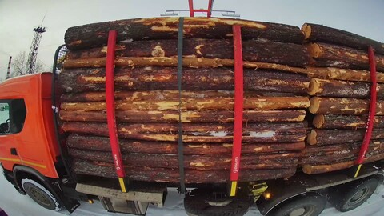
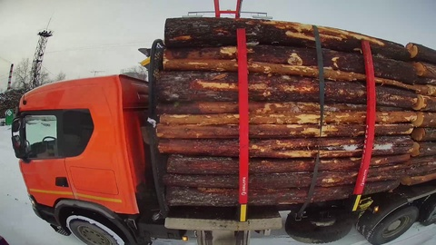
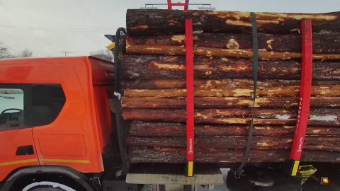
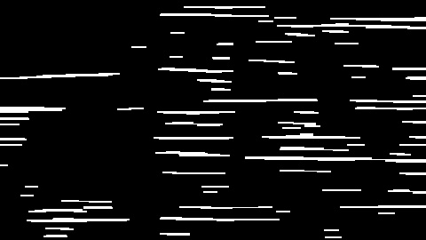
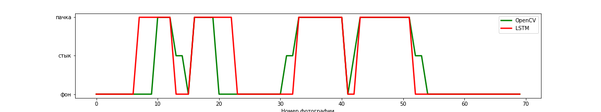

# Определение объема древесины по видео

## Задача
Анализ видеопотока со статической камеры. Мимо камеры проезжают лесовозы, 
требуется определять коэффициент полнодревесности для каждой пачки в лесовозе.

> **Пачка** --- связка бревен.

> **Коэффициент полнодревесности (Кпд)** --- отношение объема лесоматериалов, находящихся в пачке, к его геометрическому объему.

## Данные
* Для каждого лесовоза: последовательность фронтальных фотографий (~1fps) 
в разрешении 1920x1080.
* Для каждой пачки: сорт древесины, предсказанный экспертом.
* Для каждой пачки: коэффициент полнодревесности, предсказанный экспертом.

  

## Подзадачи
Были выделены следующие подзадачи:
* Предобработка фотографий
* Матчинг фотографий лесовоза с пачкой, которая запечатлена на фотографии.
* Определение сорта древесины (задача классификации).
* Генерация признаков и предсказание Кпд (задача регрессии).
* Визуализация результатов.

### Предобработка

С помощью библиотеки `opencv` были подобраны коэффициенты 
матрицы обратного преобразования и исправлены искажения от камеры. 

  

  

### Матчинг пачек
Так как требуется определять Кпд для каждой пачки в лесовозе, необходимо понять,
какие фотографии соответствуют каждой пачке.
Эта задача осложняется отсутствием разметки.

Было принято решение выделить на каждой фотографии горизонтальные линии,
описывающие бревна, посчитать по ним какие-то статистики и перейти таким образом 
от последовательности фотографий к одному или нескольким временным рядам. 
Далее классифицировать каждую точку временного ряда на три класса: фон, пачка и стык пачек.
Из этой разметки однозначно можно восстановить какие фотографии относятся к каждой пачке.

Пример отфильтрованной фотографии с выделенными горизонтальными линиями:

  

После этого на основе черновой разметки была обучена модель `LSTM`.
Входная последовательность --- эмбеддинги фотографий, выходная --- метки.
Эмбеддинги взяты из модели `ResNet18`, предобученной на датасете ImageNet.

| Method | Accuracy |
| ----------- | ----------- |
| Opencv | 0.68 |
| LSTM | 0.81 |
| LSTM после фильтрации бракованных   фотографий и ошибок в исходных данных | 0.93 |

Accuracy замерялась как совпадение действительного количества пачек
в лесовозе с количеством пачек, полученном из разметки.

Пример разметки одного лесовоза:

  

### Предсказание сорта
Для предсказания сорта древесины в 
пачке использовалась предобученная на датасете `ImageNet` модель `ResNet18`.
Предсказание выполнялось для 5 фотографий одной пачки, после чего выбирался мажорирующий класс.

| Method | Accuracy |
| ----------- | ----------- |
| Baseline | 0.75 |
| ResNet | 0.94 |

### Генерация признаков и предсказание Кпд
По каждой фотографии сгенерировано более 130 признаков, 
в том числе цветовые гистограммы, 
статистики по найденным горизонтальным линиям из задачи матчинга, сорт дерева и т.д. 

В качестве основной модели использовался `Catboost`.

| Model | RMSE | MAPE | R2 |
| ----------- | ----------- | ----------- | ----------- |
| Baseline | 0.034 | 3.63 | 0.0 |
| ElasticNet | 0.024 | 2.95 | 0.506 |
| **Catboost** | **0.019** | **2.12** | **0.653**|

### Визуализация
С помощью библиотеки `streamlit` разработан интерактивный веб-интерфейс для
визуализации результатов работы.
